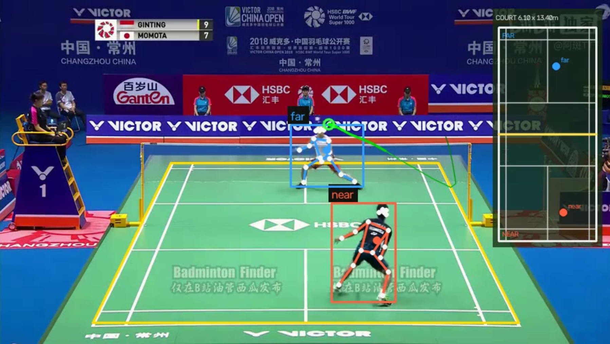
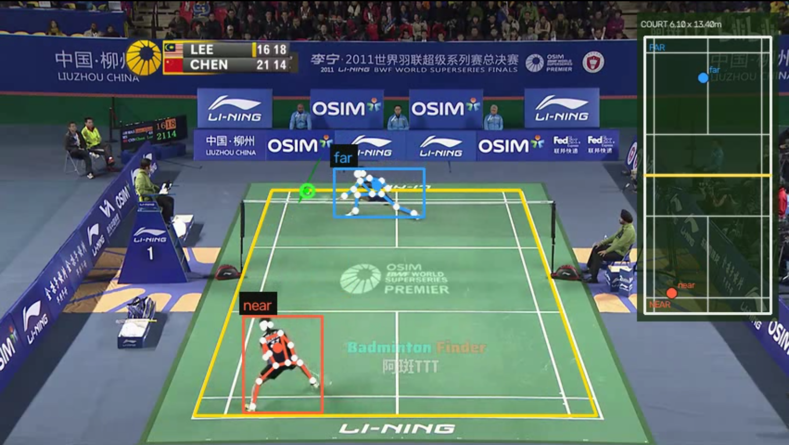
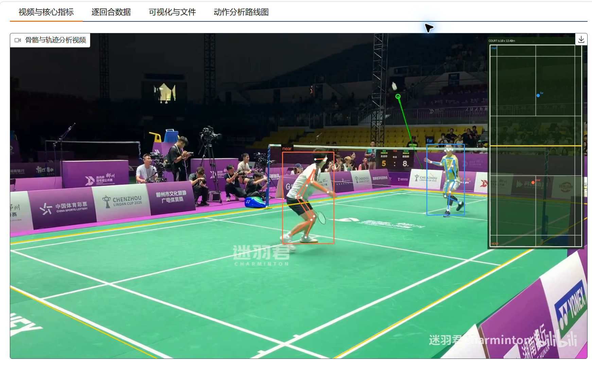
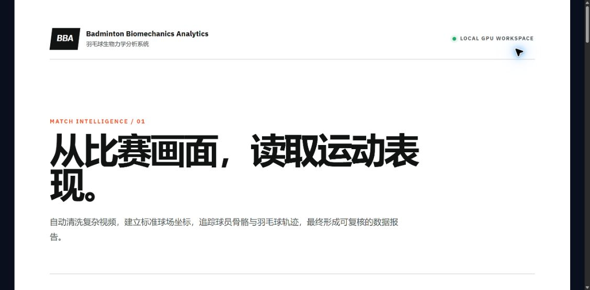
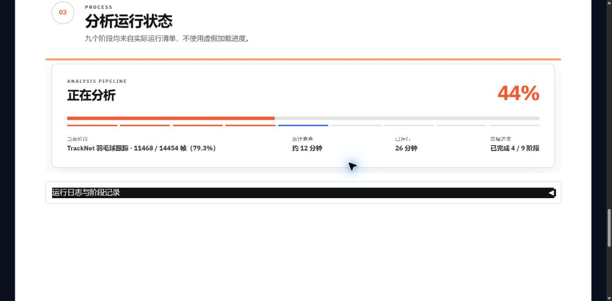

# BBA · 让普通运动视频真正产生价值

> **Badminton Biomechanics Analytics**<br>
> 从一段随手拍摄或公开转播的羽毛球视频出发，自动完成片段清洗、场地标定、球员骨骼与羽毛球追踪，并生成可以观看、量化和复核的运动表现报告。



## 我们在做什么

运动视频随处可见，但真正可用的运动分析仍然昂贵、复杂，并且往往依赖专业设备和大量人工操作。

BBA 希望缩短这段距离：用户上传一段视频，选择拍摄视角，确认一次球场，系统便自动完成分析并交付结果。它不只是给画面画几个框，而是把视频转化为一套有时间、有位置、有置信度、可以回到原始画面核对的数据。

我们的目标很直接：

> **让普通人手中的普通视频，也能成为训练复盘和运动研究的起点。**

BBA 是我们已经做出来的第一个应用，但它不是终点。我们真正希望建立的是一套**通用人体运动分析平台**：同一套人体识别、个体建模、三维运动学、质量控制和报告基础，可以加载不同的“运动知识包”，从而分析羽毛球、健身、跑步以及更多有人体动作规律可循的运动。

| 今天 | 下一步 | 长期目标 |
|---|---|---|
| 已能一键分析羽毛球视频 | 建立用户个体骨架并验证健身动作 | 一个核心支持多个运动项目的开放平台 |

## 已经完成的成果

BBA 目前已经形成一条可以实际运行的一键流程：

- 从含有采访、回放、特写和切镜头的完整比赛视频中自动寻找可用回合；
- 支持已经裁切的视频，也支持俯视和低视角素材；
- 使用 RTMPose 跟踪球网两侧球员及人体骨骼；
- 使用 TrackNet 追踪高速、小尺寸的羽毛球；
- 自动识别球场，并允许用户用标准球场模型进行人工修正；
- 把球员位置映射到 6.10 m × 13.40 m 的标准羽毛球场；
- 计算移动距离、速度、站位、重心相对高度、追踪覆盖率和逐回合指标；
- 初步识别击球候选、挥拍阶段、二维关节角、稳定性和步法特征；
- 生成带骨骼、球路和场地位置的分析视频，以及 CSV、JSON、图表和完整运行记录；
- 提供本地 WebUI、真实阶段进度、动态预计用时和中断恢复能力。

整个流程默认在用户自己的电脑和 NVIDIA GPU 上运行，视频不必上传到第三方云服务。目前自动化测试覆盖 **176 项测试**，用于保护数据契约、标定、跟踪、分析、报告和 WebUI 的关键行为。

## 两种视角，都能进入同一套分析流程

<table>
  <tr>
    <td width="50%"></td>
    <td width="50%"></td>
  </tr>
  <tr>
    <td align="center"><strong>标准转播 / 俯视角</strong><br>双端骨骼、球路与标准球场位置</td>
    <td align="center"><strong>低视角 / 侧面机位</strong><br>面对强透视、遮挡与远端小目标</td>
  </tr>
</table>

低视角远比标准转播视角困难：远端人物可能只有很少的像素，场地角点也可能落在画面外。我们已经为这种素材建立了独立配置和人工校正机制。系统发现证据不足时会显示拒绝原因，而不是生成看起来精确但实际不可靠的数字。

## 使用者最终会得到什么

<table>
  <tr>
    <td width="50%"></td>
    <td width="50%"></td>
  </tr>
  <tr>
    <td align="center">上传、选择视角、核对场地</td>
    <td align="center">查看真实阶段、帧进度和预计用时</td>
  </tr>
</table>

一次分析会形成四类成果：

1. **可观看的分析视频**：骨骼、球员、球路和标准场地位置同步呈现。
2. **可理解的运动指标**：按球员、回合和全场整理移动、速度、站位和身体姿态。
3. **可继续研究的数据**：轨迹、关键点、事件、阶段和质量信息均可导出。
4. **可复核的证据链**：每项结果都能追溯到视频、帧、模型、配置和运行阶段。

这使 BBA 不仅适合制作演示视频，也可以成为教练复盘、运动科研、算法实验和数据标注的基础工具。

## 我们没有从零造轮子

BBA 基于 [yo-WASSUP/Good-Badminton](https://github.com/yo-WASSUP/Good-Badminton) 继续开发，并使用 RTMPose、RTMLib、TrackNet、OpenCV 等成熟开源成果。我们感谢上游作者和开源社区提供的研究与工程基础。

在此基础上，我们重点补齐了从“算法演示”到“完整工作流”之间缺失的部分：

- 复杂长视频自动清洗；
- 一致的数据契约和质量门槛；
- 俯视与低视角双路线；
- 标准球场建模与可越出画面的人工标定；
- 可靠的双端球员身份分配；
- 受约束的羽毛球轨迹插值；
- 可恢复的一键管线；
- 面向非开发者的 WebUI 和完整结果报告。

下一阶段同样坚持复用成熟方案：二维姿态继续使用 RTMPose，个体骨架和逆运动学优先采用 [OpenSim](https://github.com/opensim-org/opensim-core)，多视角验证参考 [Pose2Sim](https://github.com/perfanalytics/pose2sim)，整体生物力学流程参考 [OpenCap](https://www.opencap.ai/)。我们真正需要投入的地方，是把这些能力可靠地连接起来，并建立适合具体运动的知识、数据和验证标准。

## 真正的下一站：通用人体运动分析平台

我们并不是简单地给 BBA 再增加几个动作标签。后续建设目标是一套独立于具体运动项目的基础平台，使“分析一种新运动”不再需要重新开发视频上传、人体识别、骨骼跟踪、三维重建、数据格式、质量门槛和报告系统。

平台可以理解为五层：

### 1. 视频与人体观测层

负责视频解码、人物检测、身份跟踪、二维骨骼、相机信息和时间同步。羽毛球、深蹲与跑步都共享这一层，不为每项运动重复运行一套姿态模型。

### 2. 个体人体模型层

用户首次使用时完成引导式身体标定：输入身高，通过正面、侧面以及可选的 360° 全身视频，建立自己的身体档案，包括体段长度、关节中心、左右侧差异、模型质量和数据来源。

后续视频不再只套用“平均人体”，而是使用同一个人的骨架比例约束动作估计。档案可以复用、重新标定、比较版本，也可以由用户彻底删除。

### 3. 运动学与生物力学层

这一层把二维观测、个体骨架、相机与地面、时间连续性、关节活动范围和脚部接触结合起来，得到带不确定性的运动学结果。我们计划复用 OpenSim 等成熟框架完成个体骨架缩放和逆运动学，而不是自行编写一套未经验证的求解器。

需要强调的是，360° 视频提供的是更好的个体先验，并不会让后续单目视频天然变成无误差的三维动作捕捉。单目仍然存在深度、遮挡和出平面旋转歧义，因此每项三维结果都必须携带误差、置信度和拒绝条件。

### 4. 运动知识包层

平台核心只负责“这个人如何运动”，具体项目知识由可插拔的运动包提供：

| 运动包 | 可以逐步分析的内容 |
|---|---|
| 羽毛球 | 击球类型、挥拍阶段、步法、回位、站位和球员—球—球场关系 |
| 健身 | 重复次数、动作阶段、节奏、活动幅度、对称性、稳定性和个人基线变化 |
| 跑步 | 步频、触地阶段、身体起伏、左右差异和周期稳定性 |
| 其他球类 | 跑动、跳跃、投掷或挥击动作，以及人与球和场地的关系 |

每个运动包都应包含受支持动作、拍摄要求、阶段定义、指标、专家审核规则、参考资料和冻结验证集。增加新项目时主要增加知识包，而不是复制整套平台。

### 5. 评价与交付层

系统把结果组织为视频、时间轴、曲线、指标、证据帧和可读建议，并提供 API/CSV/JSON 给研究人员和开发者。它同时负责回答三个问题：

- 系统直接看到了什么；
- 哪些结果是根据模型估计或推导的；
- 哪些问题因为证据不足而不能回答。

动作评价将来自结构化指标、经过验证的模型和专家审核规则。语言模型未来可以负责解释和对话，但不能凭画面自由生成生物力学结论。

## 平台如何被使用

```text
首次使用
录制正面 / 侧面 / 可选 360° 标定
              |
              v
建立可复用的个人身体档案
              |
              v
选择运动项目和动作 -> 上传日常单目视频
              |
              v
通用人体运动核心完成跟踪、运动学与质量判断
              |
              v
对应运动知识包完成阶段、指标和评价
              |
              v
分析视频 + 个人报告 + 历史对比 + 可下载数据
```

对于不希望建立长期档案的用户，平台仍保留 Quick 模式，使用身高和一次性视频进行有限分析；对于教练、工作室和研究合作，则提供包含 360° 与功能标定动作的 Pro 模式。

## 为什么从羽毛球和深蹲开始

通用平台不能靠同时支持几十个未经验证的动作来证明。羽毛球提供了复杂真实视频、多人、球场、快速小球和切镜头问题，是平台工程能力的第一个压力测试；深蹲则适合验证个体化人体模型和动作评价。

首个健身动作计划从自重深蹲开始，再扩展弓步和俯卧撑，因为：

- 拍摄方式可以清楚引导；
- 动作重复和阶段比较明确；
- 容易与教练和多机位参考数据进行验证；
- 用户可以反复录制，观察节奏、幅度、对称性和稳定性的变化。

深蹲第一版会聚焦重复次数、动作阶段、节奏、关节角度、左右差异、最低点一致性和个人历史变化。它是通用平台的第二个完整实例，而不是另起一套健身代码。

## 通用平台开发路线

### 阶段一：从 BBA 中抽出通用核心

- 建立与运动项目无关的人体观测、运动指标、质量和不确定性数据契约；
- 将现有 RTMPose、二维关节角和评测能力迁入通用模块；
- 羽毛球事件、BST 分类、球路和球场逻辑保留为羽毛球知识包；
- 通过兼容层保证现有 BBA 一键分析不发生功能回退。

**交付结果：** BBA 继续运行，同时形成第一个可被其他运动调用的 Motion Core。

### 阶段二：建立个人身体档案

- 完成 Quick 标定：身高、正面、侧面和尺度参照；
- 完成 Pro 标定：引导式 360° 视频和少量功能动作；
- 建立体段长度、关节中心、标定质量、版本和隐私删除机制；
- 优先建立个体骨架，不把写实外观网格作为分析前置条件。

**交付结果：** 同一用户的后续视频可以复用经过质量验证的身体比例。

### 阶段三：接入个体化三维运动学

- 接入 OpenSim 个体模型缩放和逆运动学；
- 建立可替换的单目三维重建接口；
- 使用 Pose2Sim/OpenCap 风格的多视角流程建立参考数据；
- 逐关节验证误差，并在三维不可靠时自动退回二维结果或拒绝分析。

**交付结果：** 获得有坐标系、有误差、有证据来源的个体化三维运动序列，而不是只有视觉效果的三维骨架。

### 阶段四：完成第二个垂直应用

- 建立自重深蹲知识包；
- 完成重复计数、动作分段、节奏、活动幅度、对称性和稳定性；
- 与教练标注和多视角参考结果进行冻结测试；
- 将录制引导、预检、分析和个人历史对比接入 WebUI。

**交付结果：** 证明同一通用核心可以同时支撑羽毛球和健身动作分析。

### 阶段五：形成开放的平台能力

- 增加弓步、俯卧撑、跑步和新的球类知识包；
- 提供稳定的插件接口、数据格式和批处理/API；
- 允许高校、教练和开发者编写自己的动作标准和报告模板；
- 建立经过授权的数据、模型版本、测试基准和第三方许可证清单。

**交付结果：** 从单一项目成长为能够持续接入新运动、新模型和新研究成果的开放平台。

详细的模块拆分、开源选型、数据契约、GM-00～GM-08 开发批次和验收门槛已经写入[通用人体运动分析平台开发计划](badmintondataprocess/docs/general_motion_platform_development_plan.md)。

## 我们当前最需要什么

### 1. 专业意见

我们希望得到计算机视觉、生物力学、体能训练和运动教学从业者的批评。尤其需要帮助回答：哪些指标真正对训练有用，哪些看似专业但容易误导，以及怎样建立合理的动作验证标准。

### 2. 数据与验证合作

我们需要在获得明确授权的前提下，采集不同体型、机位、光照、动作水平和设备的视频；也希望与具备多相机、动作捕捉、测力台或教练标注能力的团队合作，为系统建立可信的参考数据。

### 3. 开源贡献

欢迎参与姿态与目标跟踪、OpenSim 适配、数据标注、动作阶段、WebUI、测试、文档和跨平台运行。项目不会要求每位贡献者都了解全部管线，可以从一个清晰、可验证的模块开始。

### 4. 资源与赞助

资金、设备或算力赞助将优先用于：

- 构建经授权的多样化验证数据集；
- 邀请教练与生物力学专家参与标注和规则审核；
- 购买必要的模型商业许可或替换受限依赖；
- 多机位参考采集、相机和计算设备；
- 提升 Windows/Linux 环境、安装流程和长视频运行可靠性；
- 支持核心维护者持续完成测试、文档和版本发布。

每一项投入都应对应可以检查的产物，例如冻结测试集、误差报告、新动作包、稳定发行版或公开技术文档，而不是只制作更漂亮的展示画面。

## 为什么值得参与

BBA 当前并不是一张概念图。完整视频清洗、双端骨骼、羽毛球轨迹、球场映射、数据报告和一键 WebUI 已经可以运行。与此同时，我们也清楚知道距离可信的个体化三维运动分析还有哪些工程、数据和验证工作。

这恰好是项目最适合引入意见与合作的阶段：

- 基础流程已经存在，建议可以很快变成可运行改进；
- 架构仍然开放，能够吸收不同领域的专业知识；
- 项目坚持开源归属、结果可追溯和能力边界；
- 从羽毛球开始，但技术积累可以逐步服务更多日常运动场景。

> 我们希望共同建立的，不是一个会对视频说几句好听话的“AI 教练”，而是一套能说明自己看到了什么、怎么算出来、什么时候不应该下结论的运动分析工具。

## 了解和联系项目

- GitHub：[reflectstars111/BBA-Badminton-Biomechanics-Analytics](https://github.com/reflectstars111/BBA-Badminton-Biomechanics-Analytics)
- 使用与效果介绍：[README 中文版](README.md)
- 完整后续计划：[通用人体运动分析平台开发计划](badmintondataprocess/docs/general_motion_platform_development_plan.md)
- 问题、建议与合作意向：可通过 GitHub Issues 或仓库公开联系方式提出。

如果你是运动员、教练、研究者、开发者，或者愿意帮助一个开源运动分析项目走得更远，我们都期待听到你的意见。
